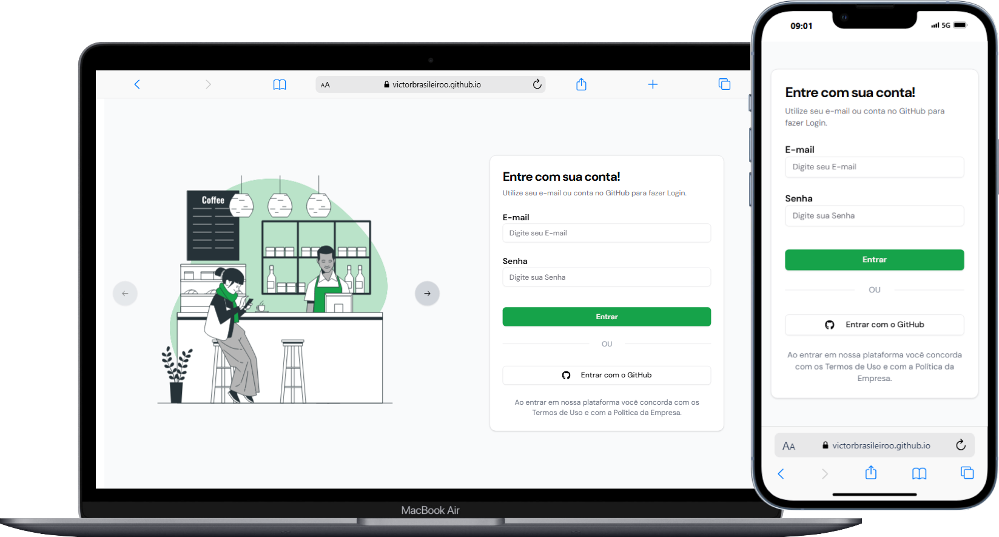

# LoginScreen Project

Este é um projeto de uma tela de login simples e responsiva desenvolvida usando React, Tailwind CSS, Vite e Shadcn. A aplicação foi criada com o objetivo de fornecer uma interface de login elegante e eficiente para autenticação de usuários.

## 

## Acesso ao Demo do site 👉🏻 <a href='https://victorbrasileiroo.github.io/LoginScreen/'>Clique Aqui ❗</a>

## Índice

- [Recursos](#recursos)
- [Tecnologias Utilizadas](#tecnologias-utilizadas)
- [React + Vite](#React-+-Vite)

## Recursos

- **Responsivo:** Layout otimizado para diferentes tamanhos de tela, incluindo dispositivos móveis.
- **Rápido e leve:** Desenvolvido usando Vite, um build tool extremamente rápido e eficiente.
- **Estilização moderna:** Utiliza Tailwind CSS e Shadcn para criar um design limpo e moderno.
- **Fácil de customizar:** Estrutura modular e componentes reutilizáveis que facilitam a customização da interface.

## Tecnologias Utilizadas

- **React:** Biblioteca JavaScript para construção de interfaces de usuário.
- **Vite:** Ferramenta de build que oferece um ambiente de desenvolvimento ultrarrápido.
- **Tailwind CSS:** Framework de utilitários CSS altamente customizável.
- **Shadcn:** Sistema de design para construção de interfaces consistentes e acessíveis.

# React + Vite

This template provides a minimal setup to get React working in Vite with HMR and some ESLint rules.

Currently, two official plugins are available:

- [@vitejs/plugin-react](https://github.com/vitejs/vite-plugin-react/blob/main/packages/plugin-react/README.md) uses [Babel](https://babeljs.io/) for Fast Refresh
- [@vitejs/plugin-react-swc](https://github.com/vitejs/vite-plugin-react-swc) uses [SWC](https://swc.rs/) for Fast Refresh
